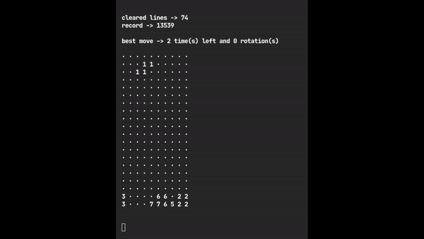
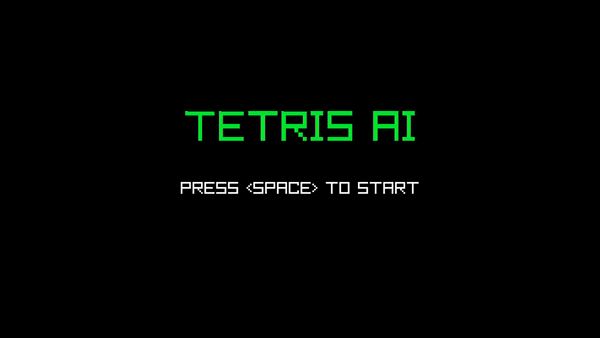

# Tetris genetic algorithm

Tetris genetic algorithm written in C++ inspired by [this](https://codemyroad.wordpress.com/2013/04/14/tetris-ai-the-near-perfect-player/) article, with some changes.

## Train de AI

If an agent better than the saved one gets generated during training, parameters are automatically updated.

```sh
git clone https://www.github.com/msmmb/genetic_tetris
cd genetic_tetris
make train
./train.o
```

## Run the AI on terminal



```sh
git clone https://www.github.com/msmmb/genetic_tetris
cd genetic_tetris
make terminal
./terminal.o
```

## Run the AI on a window



To run the AI on a window [raylib](https://www.raylib.com/) needs to be installed.

You can take/lose control of the game by pressing the `c` key.

```sh
git clone https://www.github.com/msmmb/genetic_tetris
cd genetic_tetris
make window
./window.o
```
